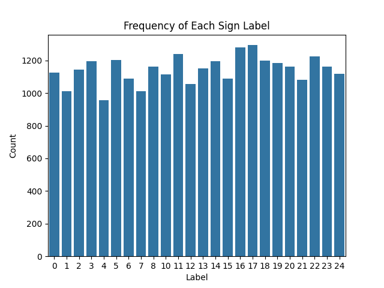
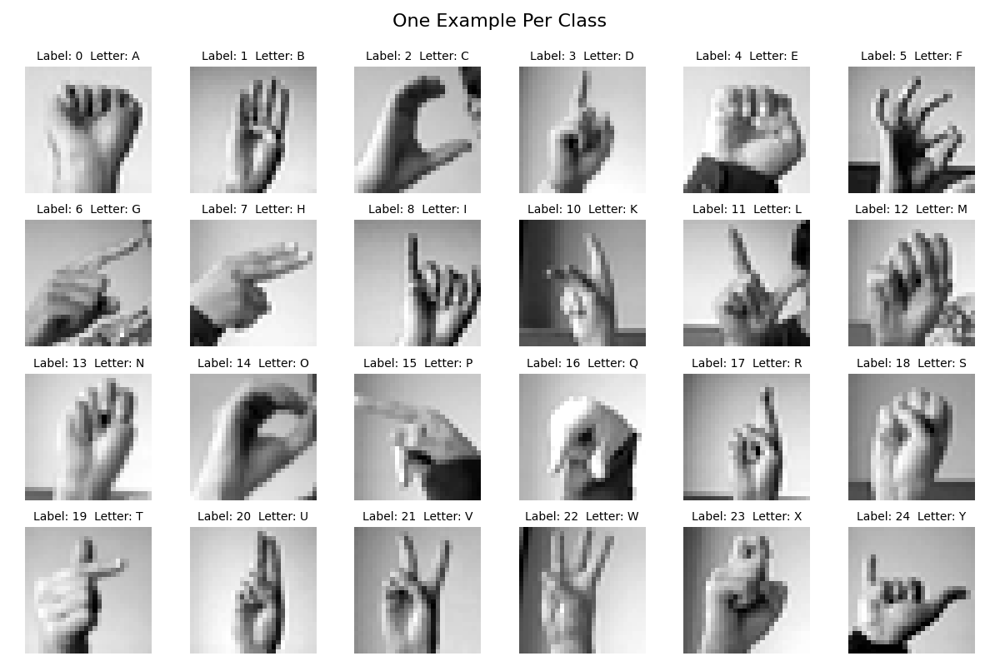
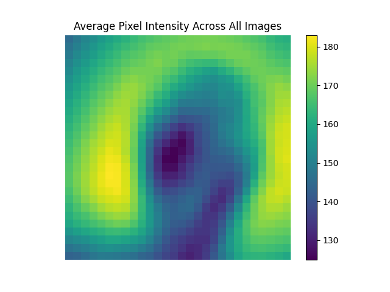
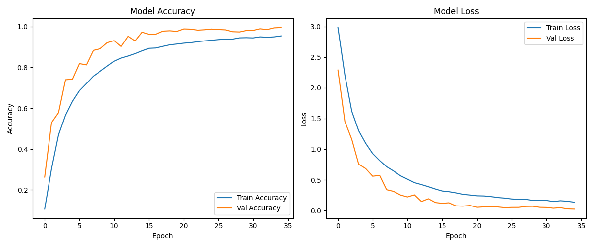
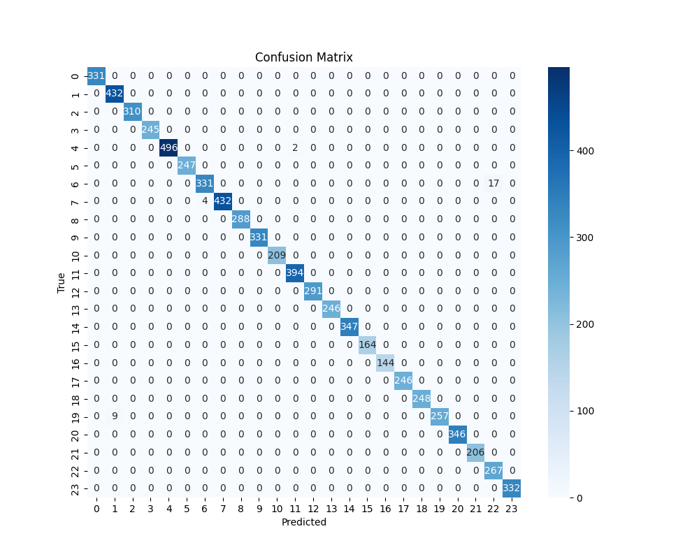

# AI Sign Language Interpreter

A deep learning-based image classification project that translates American Sign Language (ASL) alphabets from grayscale images. This project utilizes a Convolutional Neural Network (CNN) trained on the [Sign Language MNIST dataset](https://www.kaggle.com/datasets/datamunge/sign-language-mnist) to interpret static hand gestures representing the ASL alphabet (excluding J and Z).

---

## Dataset Overview

The [Sign Language MNIST dataset](https://www.kaggle.com/datasets/datamunge/sign-language-mnist) is a drop-in replacement for the classic MNIST dataset, designed specifically for hand gesture recognition tasks. It contains:

- **28×28 grayscale images** representing ASL letters
- **27,455 training samples** and **7,172 testing samples**
- **24 class labels** (A–Y, excluding J and Z due to motion-based gestures)

Each row contains a label (0–25 excluding 9 and 25) and pixel values (784 total) flattened from a 28x28 image.

---

## Exploratory Data Analysis (EDA)

The EDA was essential for understanding the structure, distribution, and quality of the data. Visualizations included:

### Class Distribution



The label distribution is relatively balanced across all 24 classes, eliminating the need for sampling or rebalancing.

### Example Sign Gestures



Representative samples of each letter confirm visually distinct patterns, making this dataset suitable for image-based classification.

### Pixel Intensity Heatmap



This plot of average pixel values across all samples shows common gesture patterns and confirms the center-weighted alignment of most hand signs.

---

## Data Preprocessing

- Normalized all pixel values to the range [0, 1]
- Reshaped data to (28, 28, 1) for compatibility with CNNs
- Applied one-hot encoding to labels using `to_categorical` from TensorFlow

The dataset was split into training and test sets using the predefined CSVs and saved into a `/data/processed/` folder for modeling.

---

## CNN Model Architecture

A deep CNN was constructed using TensorFlow’s Keras API, with the following layers:

- **Conv2D (128 filters, 5x5)** with ReLU + **MaxPooling (3x3)**
- **Conv2D (64 filters, 2x2)** with ReLU + **MaxPooling (2x2)**
- **Conv2D (32 filters, 2x2)** with ReLU + **MaxPooling (2x2)**
- **Flatten layer**
- **Dense (512 units)** with ReLU + **Dropout (0.25)**
- **Output Dense (25 units)** with softmax activation


This architecture was optimized for efficient feature extraction and classification while maintaining a relatively lightweight model footprint (≈1.2 MB).

---

## Model Training and Performance

The model was compiled using the **Adam optimizer** and **categorical crossentropy** as the loss function. It was trained over 35 epochs using an augmented data generator:

```python
ImageDataGenerator(
    width_shift_range=0.2,
    height_shift_range=0.2,
    zoom_range=0.2,
    horizontal_flip=True
)
```

### Training & Validation Metrics



The model achieved a final **test accuracy of 99.55%** with a **loss of just 0.022**, indicating high generalization and minimal overfitting.

---

## Confusion Matrix



The matrix confirms strong performance across all 24 classes, with very few misclassifications. The occasional confusion (e.g., between visually similar signs) was statistically negligible.

---

## Classification Report

The model achieved perfect or near-perfect scores across nearly all classes:

- **Precision**: 0.99–1.00
- **Recall**: 0.98–1.00
- **F1-Score**: 0.97–1.00
- **Overall Accuracy**: **99.55%**

These metrics confirm the model’s suitability for real-time applications and strong robustness across the dataset.

---

## Additional Modeling Benchmarks

As a preliminary step, multiple traditional machine learning models were tested on the raw, flattened pixel data:

- **Random Forest**: ~85% accuracy
- **Histogram-Based Gradient Boosting**: ~90% accuracy
- **K-Nearest Neighbors**: Performance plateaued after `k=5`

### KNN Elbow Plot (not shown)

Although traditional models demonstrated decent accuracy, their lack of spatial awareness limited performance. These served as helpful baselines to highlight the superiority of CNNs for image classification.

---

## Model Insights

- **Early Convergence**: Major improvements occurred within the first 15–20 epochs.
- **Dropout Effectiveness**: Helped mitigate overfitting without sacrificing accuracy.
- **Augmentation Impact**: Increased generalization on the test set despite synthetic data variations.
- **Class Separation**: Even challenging signs (e.g., T vs. R or M vs. N) were classified accurately.

---

## Business and Social Impact

This model has wide-ranging applications that extend beyond academic experimentation:

### Accessibility

- Real-time ASL recognition in video calls or public kiosks
- Integration into wearable devices or AR headsets for live translation
- Text-to-speech or subtitle generation for the hearing impaired

### Education

- Interactive learning tools for children and adults learning ASL
- Feedback-based platforms for sign language practice and correction

### Customer Service

- Sign recognition for retail or healthcare kiosks
- Communication aid in high-noise environments

### Edge Deployment

- Low-memory footprint allows deployment on devices like Raspberry Pi
- Fast inference (<5ms per image) makes it ideal for real-time use cases

---

## Project Structure

```
AI Sign Language Interpreter/
│
├── data/
│   ├── raw/                   # Original Kaggle dataset
│   └── processed/             # Scaled and cleaned datasets
│
├── images/                    # Visualizations
│   ├── accuracy_loss_plot.png
│   ├── ASL_images.png
│   ├── cnn_model_architecture.png
│   ├── confusion_matrix.png
│   ├── data_frequency.png
│   └── pixel_intensity.png
│
├── models/
│   └── model.keras            # Trained CNN model
│
├── notebooks/
│   ├── eda.ipynb              # Data analysis
│   ├── CNN_model.ipynb        # CNN development & evaluation
│   └── ml_model_testing.ipynb # Traditional model benchmarking
│
├── webcam_app.py              # Live webcam classification script
└── README.md
```

---

## Future Work

- Extend to full ASL alphabet including dynamic gestures (J and Z) via LSTM or 3D CNNs
- Integrate real-time webcam recognition with GUI overlay
- Explore model compression (pruning, quantization) for mobile deployment
- Add multilingual subtitle translation features
- Expand dataset with more diverse hand shapes, sizes, and skin tones

---

## License

This project is open-sourced under the [CC0: Public Domain License](https://creativecommons.org/publicdomain/zero/1.0/), allowing unrestricted use for educational and commercial purposes.

---

## Acknowledgments

- Dataset: [Sign Language MNIST on Kaggle](https://www.kaggle.com/datasets/datamunge/sign-language-mnist)
- Libraries: TensorFlow, Scikit-learn, Seaborn, Matplotlib, Keras
