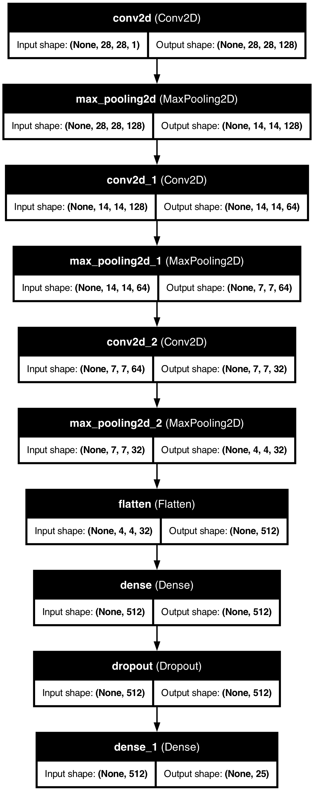

# AI Sign Language Interpreter

### [Finished Deployed Product](https://asl-interpreter.streamlit.app/)

A computer vision project that interprets American Sign Language (ASL) hand gestures from images with over 99% accuracy. Built to support accessibility and inclusive communication, this model uses deep learning techniques to classify ASL alphabet signs from grayscale images. The project leverages a Convolutional Neural Network (CNN) trained on the [Sign Language MNIST dataset](https://www.kaggle.com/datasets/datamunge/sign-language-mnist) to recognize 24 static ASL letters (excluding J and Z, which require motion).

---

## Dataset Overview

The [Sign Language MNIST dataset](https://www.kaggle.com/datasets/datamunge/sign-language-mnist) is a drop-in replacement for the classic MNIST dataset, designed specifically for hand gesture recognition tasks. It contains:

- **28×28 grayscale images** representing ASL letters
- **27,455 training samples** and **7,172 testing samples**
- **24 class labels** (A–Y, excluding J and Z as these gestures require motion)

Each row contains a label (0–25 excluding 9 and 25) and pixel values (784 total) flattened from a 28x28 image.

---

## Exploratory Data Analysis (EDA)

The EDA was essential for understanding the structure, distribution, and quality of the data. Visualizations included:

### Class Distribution


The label distribution is relatively balanced across all 24 classes, eliminating the need for sampling or rebalancing.

### Example Sign Gestures


Representative samples of each letter confirm visually distinct patterns, making this dataset suitable for image-based classification.

### Pixel Intensity Heatmap


This plot of average pixel values across all samples shows common gesture patterns and confirms the center-weighted alignment of most hand signs.

---

## Model Selection

As a preliminary step, multiple traditional machine learning models were tested on the raw, flattened pixel data:

- **Random Forest**: ~81% accuracy
- **Histogram-Based Gradient Boosting**: ~78% accuracy
- **K-Nearest Neighbors**: ~81% accuracy (Performance plateaued after `k=1`)

Although traditional models demonstrated decent accuracy, their lack of spatial awareness limited performance. These served as helpful baselines to highlight the superiority of CNNs for image classification.

---

## Data Preprocessing for CNN

- Normalized all pixel values to the range [0, 1]
- Reshaped data to (28, 28, 1) for compatibility with CNNs
- Applied one-hot encoding to labels using `to_categorical` from TensorFlow

The Kaggle dataset was already split into training and test sets but data was prepocessed and saved into the `/data/processed/` folder for modeling.

---

## CNN Model Architecture

A deep CNN was constructed using TensorFlow’s Keras API, with the following layers:

- **Conv2D (128 filters, 5x5)** with ReLU + **MaxPooling (3x3)**
- **Conv2D (64 filters, 2x2)** with ReLU + **MaxPooling (2x2)**
- **Conv2D (32 filters, 2x2)** with ReLU + **MaxPooling (2x2)**
- **Flatten layer**
- **Dense (512 units)** with ReLU + **Dropout (0.25)**
- **Output Dense (25 units)** with softmax activation

**Below is the architecture:**



This architecture was optimized for efficient feature extraction and classification while maintaining a relatively lightweight model footprint (≈1.2 MB).

---

## Model Training and Performance

The model was compiled using the **Adam optimizer** and **categorical crossentropy** as the loss function. It was trained over 35 epochs using an augmented data generator:

```python
ImageDataGenerator(
    width_shift_range=0.2,
    height_shift_range=0.2,
    zoom_range=0.2,
    horizontal_flip=True
)
```

### Training & Validation Metrics


The model achieved a final **test accuracy of 99.55%** with a **loss of just 0.022**, indicating high generalization and minimal overfitting.

---

## Confusion Matrix


The matrix confirms strong performance across all 24 classes, with very few misclassifications. The occasional confusion (e.g., between visually similar signs) was statistically negligible.

---

## Classification Report

The model achieved perfect or near-perfect scores across nearly all classes:

- **Precision**: 0.99–1.00
- **Recall**: 0.98–1.00
- **F1-Score**: 0.97–1.00
- **Overall Accuracy**: **99.55%**

These metrics confirm the model’s suitability for real-time applications and strong robustness across the dataset.

---

## Model Insights

- **Early Convergence**: Major improvements occurred within the first 15–20 epochs.
- **Dropout Effectiveness**: Helped mitigate overfitting without sacrificing accuracy.
- **Augmentation Impact**: Increased generalization on the test set despite synthetic data variations.
- **Class Separation**: Even challenging signs (e.g., T vs. R or M vs. N) were almost classified perfectly.

---

## Business and Social Impact

The AI Sign Language Interpreter addresses a critical communication gap by using computer vision to facilitate interaction between sign language users and non-signers. While built as a deep learning project, it has wide-ranging applications across accessibility, education, enterprise communication, and edge computing.

### Accessibility and Inclusion

Sign language is the primary mode of communication for millions of deaf and hard-of-hearing individuals. Yet, many public-facing and digital systems lack built-in support. This project provides a potential foundation for scalable accessibility solutions:

- **Real-Time ASL Translation**: The model can be integrated into video conferencing platforms to convert ASL gestures into real-time subtitles or speech, making meetings more inclusive.
- **Public Kiosks and Terminals**: Retail, banking, and healthcare kiosks can use this system to support ASL-based interaction, eliminating the need for touchscreens or verbal communication.
- **Wearable Device Integration**: Combined with AR devices or smart glasses, the model can power live gesture-to-text overlays to aid private and autonomous communication.
- **Assistive Technology**: Incorporation into text-to-speech tools enables individuals to speak through gesture recognition, particularly useful for non-verbal users.

### Education and Learning

The system also offers impactful uses in ASL education and language learning environments:

- **Interactive Learning Tools**: Applications built with this model can provide real-time feedback to students learning ASL, enhancing engagement and comprehension.
- **Gamified Platforms for Children**: ASL alphabet recognition can be used to create child-friendly games, making language acquisition more engaging.
- **Support for Special Education**: Educators can deploy this tool to support students with speech impairments or developmental conditions who benefit from visual communication.

### Customer Service and Industry Applications

Communication barriers in customer-facing environments and high-noise workplaces can be reduced using gesture recognition systems:

- **Retail and Healthcare Kiosks**: ASL recognition can empower customers to interact with service points using signs, improving experience for the hearing-impaired.
- **Emergency and Medical Intake**: Hospitals can use ASL interfaces in triage or emergency rooms where human interpreters may not be immediately available.
- **Industrial Communication**: In environments with high noise levels, such as airports, construction sites, or factories, gesture-based input reduces the risk of miscommunication.

### Edge Deployment and Efficiency

The model was built to run efficiently on local hardware without reliance on cloud infrastructure:

- **Edge-Ready Architecture**: With a compact design, the model can run on devices like Raspberry Pi or Jetson Nano, opening doors for deployment in embedded systems.
- **Fast Inference Time**: Predictions occur in under 5 milliseconds per frame, enabling real-time response rates necessary for practical, interactive applications.
- **Offline Functionality**: Since the model runs locally, it supports use cases in remote or low-connectivity regions, making it suitable for NGOs, education, and healthcare in underserved areas.

This project demonstrates how deep learning and computer vision can directly contribute to accessible technology, educational advancement, and inclusive design practices. Its potential spans from academic research to deployable, high-impact real-world tools.

---

## Project Structure

```
AI Sign Language Interpreter/
│
├── data/
│   ├── raw/                   # Original Kaggle datasets (Split into train and test)
│   └── processed/             # Scaled and cleaned datasets
│
├── images/                    # Visualizations
│   ├── accuracy_loss_plot.png
│   ├── ASL_images.png
│   ├── cnn_model_architecture.png
│   ├── confusion_matrix.png
│   ├── data_frequency.png
│   └── pixel_intensity.png
│
├── models/
│   └── model.keras            # Trained CNN model
│
├── notebooks/
│   ├── eda.ipynb              # Data analysis
│   ├── CNN_model.ipynb        # CNN development & evaluation
│   └── ml_model_testing.ipynb # Traditional model benchmarking
│
├── webcam_app.py              # Live webcam classification script
└── README.md
```

---

## Future Work

- Extend to full ASL alphabet including dynamic gestures (J and Z) via LSTM or 3D CNNs
- Integrate real-time webcam recognition with GUI overlay
- Explore model compression (pruning, quantization) for mobile deployment
- Add multilingual subtitle translation features
- Expand dataset with more diverse hand shapes, sizes, and skin tones

---

## License

This project is open-sourced under the [CC0: Public Domain License](https://creativecommons.org/publicdomain/zero/1.0/), allowing unrestricted use for educational and commercial purposes.

---

## Acknowledgments

- Dataset: [Sign Language MNIST on Kaggle](https://www.kaggle.com/datasets/datamunge/sign-language-mnist)
- Libraries: TensorFlow, Keras, Scikit-learn, pandas, NumPy, Seaborn, Matplotlib, OpenCV, MediaPipe, Streamlit, statistics, collections
